Case_Study_Cyclistic
================
Katie
2025-10-03

## The Task

You are a junior data analyst working on the marketing analyst team at
Cyclistic, a bike-share company in Chicago. The director of marketing
believes the company’s future success depends on maximizing the number
of annual memberships. Therefore, your team wants to understand how
casual riders and annual members use Cyclistic bikes differently. From
these insights, your team will design a new marketing strategy to
convert casual riders into annual members. But first, Cyclistic
executives must approve your recommendations, so they must be backed up
with compelling data insights and professional data visualizations.

## Setting Up Our Environment

As always, We will begin by installing our necessary packages and
loading our libraries.

``` r
library(tidyverse)
library(dplyr)
library(ggplot2)
library(janitor)
library(readr)
library(tidyr)
library(lubridate)
library(readxl)
library(RColorBrewer)
library(googlesheets4)
```

We’ll be accessing the data from Google Drive.

``` r
##Authorise Google Drive on your unit
gs4_auth()
```

    ## ! Using an auto-discovered, cached token.

    ##   To suppress this message, modify your code or options to clearly consent to
    ##   the use of a cached token.

    ##   See gargle's "Non-interactive auth" vignette for more details:

    ##   <https://gargle.r-lib.org/articles/non-interactive-auth.html>

    ## ℹ The googlesheets4 package is using a cached token for
    ##   'katelyn.peterson28@gmail.com'.

## Getting a look around

Having downloaded and saved the original data locally, we will first
import the data. The files are large, and may take some time to load!

``` r
Trips_2019_Q1_1 <- read_sheet("https://docs.google.com/spreadsheets/d/18UEVcgg0CN8KurLXWgxdu4zEv2paqK_LUcwNeDFh854")
```

    ## ✔ Reading from "Cyclistic_Trips_2019_Q1_1".

    ## ✔ Range 'Cyclistic_Trips_2019_Q1_1'.

``` r
Trips_2019_Q1_2 <- read_sheet("https://docs.google.com/spreadsheets/d/1wm550TfNn7GM_Qfx3-_BGD8KCxRvn-CLGVARV2zvgF0/edit?usp=sharing")
```

    ## ✔ Reading from "Cyclistic_Trips_2019_Q1_2".

    ## ✔ Range 'Cyclistic_Trips_2019_Q1_2'.

``` r
Trips_2020_Q1_1 <- read_sheet("https://docs.google.com/spreadsheets/d/13FL8PMfKXm57Kpy53u_riln9LwY9YUL2g0bTpLYUFkM/edit?usp=sharing")
```

    ## ✔ Reading from "Cyclistic_Trips_2020_Q1_1".

    ## ✔ Range 'Cyclistic_Trips_2020_Q1_1'.

``` r
Trips_2020_Q1_2 <- read_sheet("https://docs.google.com/spreadsheets/d/1YslQ77tRxepiIDlPmNSpemh_3THgq857XScq05wkmuQ/edit?usp=sharing")
```

    ## ✔ Reading from "Cyclistic_Trips_2020_Q1_2".

    ## ✔ Range 'Cyclistic_Trips_2020_Q1_2'.

Now we can take a peek at what we’ve got to work with.

``` r
#Quick look at the column names
colnames(Trips_2019_Q1) 
```

    ##  [1] "trip_id"           "start_time"        "end_time"         
    ##  [4] "bikeid"            "tripduration"      "from_station_id"  
    ##  [7] "from_station_name" "to_station_id"     "to_station_name"  
    ## [10] "usertype"          "gender"            "birthyear"

``` r
colnames(Trips_2020_Q1)
```

    ##  [1] "ride_id"            "rideable_type"      "started_at"        
    ##  [4] "ended_at"           "start_station_name" "start_station_id"  
    ##  [7] "end_station_name"   "end_station_id"     "start_lat"         
    ## [10] "start_lng"          "end_lat"            "end_lng"           
    ## [13] "member_casual"

``` r
head(Trips_2019_Q1)
```

    ## # A tibble: 6 × 12
    ##    trip_id start_time          end_time            bikeid tripduration
    ##      <dbl> <dttm>              <dttm>               <dbl>        <dbl>
    ## 1 21742443 2019-01-01 00:04:00 2019-01-01 00:11:00   2167          390
    ## 2 21742444 2019-01-01 00:08:00 2019-01-01 00:15:00   4386          441
    ## 3 21742445 2019-01-01 00:13:00 2019-01-01 00:27:00   1524          829
    ## 4 21742446 2019-01-01 00:13:00 2019-01-01 00:43:00    252         1783
    ## 5 21742447 2019-01-01 00:14:00 2019-01-01 00:20:00   1170          364
    ## 6 21742448 2019-01-01 00:15:00 2019-01-01 00:19:00   2437          216
    ## # ℹ 7 more variables: from_station_id <dbl>, from_station_name <chr>,
    ## #   to_station_id <dbl>, to_station_name <chr>, usertype <chr>, gender <chr>,
    ## #   birthyear <dbl>

``` r
head(Trips_2020_Q1)
```

    ## # A tibble: 6 × 13
    ##   ride_id          rideable_type started_at          ended_at           
    ##   <chr>            <chr>         <dttm>              <dttm>             
    ## 1 EACB19130B0CDA4A docked_bike   2020-01-21 20:06:00 2020-01-21 20:14:00
    ## 2 8FED874C809DC021 docked_bike   2020-01-30 14:22:00 2020-01-30 14:26:00
    ## 3 789F3C21E472CA96 docked_bike   2020-01-09 19:29:00 2020-01-09 19:32:00
    ## 4 C9A388DAC6ABF313 docked_bike   2020-01-06 16:17:00 2020-01-06 16:25:00
    ## 5 943BC3CBECCFD662 docked_bike   2020-01-30 08:37:00 2020-01-30 08:42:00
    ## 6 6D9C8A6938165C11 docked_bike   2020-01-10 12:33:00 2020-01-10 12:36:59
    ## # ℹ 9 more variables: start_station_name <chr>, start_station_id <dbl>,
    ## #   end_station_name <chr>, end_station_id <dbl>, start_lat <dbl>,
    ## #   start_lng <dbl>, end_lat <dbl>, end_lng <dbl>, member_casual <chr>

Looking at these data sets it is clear that they are going to need some
adjusting in order to be compared or used together.

One major difference is in how the ride / trip ID is named between 2019
and 2020. 2020 changes from the former numeric list to an alphanumeric
datatype. We’ll need to remember this when we go to merge the data sets.

2019 shows data on the riders themselves, like gender and age, but 2020
instead focuses on geographical locations using longitude and latitude
of the ride start and end points.

We can get some stats about trip duration based on customer type:

``` r
##Calculate trip duration in minutes
Trips_2019_Q1$start_time <- as.POSIXct(Trips_2019_Q1$start_time, format = "%Y-%m-%d %H:%M:%S")
Trips_2019_Q1$end_time <- as.POSIXct(Trips_2019_Q1$end_time, format = "%Y-%m-%d %H:%M:%S")
Trips_2019_Q1$trip_duration_min <- difftime(Trips_2019_Q1$end_time, Trips_2019_Q1$start_time, units = "mins") 
Trips_2019_Q1$trip_duration_min <- as.numeric(Trips_2019_Q1$trip_duration_min)

##Get info on those trips
Trips_2019_Q1 %>% 
  group_by(usertype) %>%
  summarise(min_trip_duration = min(trip_duration_min),
            max_trip_duration = max(trip_duration_min),
            mean_trip_duration = mean(trip_duration_min),
            count = n())
```

    ## # A tibble: 2 × 5
    ##   usertype   min_trip_duration max_trip_duration mean_trip_duration  count
    ##   <chr>                  <dbl>             <dbl>              <dbl>  <int>
    ## 1 Customer               1.000            177200               61.9  23163
    ## 2 Subscriber             1.000            101607               13.9 341906

``` r
##Calculate trip duration in minutes
Trips_2020_Q1$started_at <- as.POSIXct(Trips_2020_Q1$started_at, format = "%m/%d/%Y %H:%M:%S")
Trips_2020_Q1$ended_at <- as.POSIXct(Trips_2020_Q1$ended_at, format = "%m/%d/%Y %H:%M:%S")
Trips_2020_Q1$trip_duration_min <- difftime(Trips_2020_Q1$ended_at, Trips_2020_Q1$started_at, units = "mins") 
Trips_2020_Q1$trip_duration_min <- as.numeric(Trips_2020_Q1$trip_duration_min)
head(Trips_2020_Q1)
```

    ## # A tibble: 6 × 14
    ##   ride_id          rideable_type started_at          ended_at           
    ##   <chr>            <chr>         <dttm>              <dttm>             
    ## 1 EACB19130B0CDA4A docked_bike   2020-01-21 20:06:00 2020-01-21 20:14:00
    ## 2 8FED874C809DC021 docked_bike   2020-01-30 14:22:00 2020-01-30 14:26:00
    ## 3 789F3C21E472CA96 docked_bike   2020-01-09 19:29:00 2020-01-09 19:32:00
    ## 4 C9A388DAC6ABF313 docked_bike   2020-01-06 16:17:00 2020-01-06 16:25:00
    ## 5 943BC3CBECCFD662 docked_bike   2020-01-30 08:37:00 2020-01-30 08:42:00
    ## 6 6D9C8A6938165C11 docked_bike   2020-01-10 12:33:00 2020-01-10 12:36:59
    ## # ℹ 10 more variables: start_station_name <chr>, start_station_id <dbl>,
    ## #   end_station_name <chr>, end_station_id <dbl>, start_lat <dbl>,
    ## #   start_lng <dbl>, end_lat <dbl>, end_lng <dbl>, member_casual <chr>,
    ## #   trip_duration_min <dbl>

``` r
##Get info on those trips
Trips_2020_Q1 %>% 
  group_by(member_casual) %>%
  summarise(min_trip_duration = min(trip_duration_min),
            max_trip_duration = max(trip_duration_min),
            mean_trip_duration = mean(trip_duration_min),
            count = n()) 
```

    ## # A tibble: 2 × 5
    ##   member_casual min_trip_duration max_trip_duration mean_trip_duration  count
    ##   <chr>                     <dbl>             <dbl>              <dbl>  <int>
    ## 1 casual                       -9           156450                95.8  48480
    ## 2 member                        0            93794.               12.7 378407

In both years we see a marked difference in the ride length of members
versus casual riders. *(It appears that between 2019 and 2020 there was
a change in the internal language concerning usertype, so we will align
with the most current terms.)*

We also see significant growth in our casual rides, while members seem
to be on a slower rise.

We also see that the minimum trip duration in 2020 is negative, so let’s
clean a bit more.

``` r
##All of the negative and most of the low duration trips appear to be happening at HQ QR - assuming that this is for testing purposes and not actual riders we are going to leave out any rides originating at HQ QR. 
clean_Trips_2020_Q1 <- Trips_2020_Q1 %>% 
  filter(start_station_name != "HQ QR") 

##Now we can check our stats again... 
clean_Trips_2020_Q1 %>% 
  group_by(member_casual) %>% 
  summarise(min_trip_duration = min(trip_duration_min), 
            max_trip_duration = max(trip_duration_min), 
            mean_trip_duration = mean(trip_duration_min),
            count = n())
```

    ## # A tibble: 2 × 5
    ##   member_casual min_trip_duration max_trip_duration mean_trip_duration  count
    ##   <chr>                     <dbl>             <dbl>              <dbl>  <int>
    ## 1 casual                        0           156450               104.   44714
    ## 2 member                        0            93794.               12.7 378406

That’s starting to look better. Now that we’re acquainted with the data
we can start to really polish it up.

## Cleaning Our Data

I started off by converting the original .csv files into excel
spreadsheets.

I adjusted column locations and names to allow the two spreadsheets to
match. I used features like find and replace to change subscriber and
customer in 2019 to match the evolution in company terminology to member
and casual.

I also added columns to calculate trip_duration in minutes as well as
days for the longer duration rides.

- To get the time spent in minutes:  
  `=([@[end_time]]-[@[start_time]])*1440`

- To get the time spent in hours:  
  `=[@[trip_duration_min]]/60/24`

To get data on which day of the week had more rides I first needed to
figure out which day of the week the rides were happening on.

- To get a number value representing the start_time day of the week:  
  `=WEEKDAY([@[start_time]],1)`

- To transform those numerical digits to intelligible days:  
  `=IFS([@[day_of_week]]=1, "Sunday", [@[day_of_week]]=2, "Monday", [@[day_of_week]]=3, "Tuesday", [@[day_of_week]]=4, "Wednesday", [@[day_of_week]]=5, "Thursday", [@[day_of_week]]=6, "Friday", [@[day_of_week]]=7, "Saturday")`

In that vein, I was also interested in which season saw more usage. As
we only have data on Q1 that means that we’re working with data from
January to March. I wanted to know if we would see ridership increase as
the weather improved.

- To determine the month of the start_time:  
  `=MONTH([@[start_time]])`

- To determine the season based on the month:  
  `=IFS([@month]<3, "Winter", [@month]<6, "Spring", [@month]<9, "Summer", [@month]<12, "Fall", [@month]=12, "Winter")`

## Merge

After much cleaning, we are ready to merge our excel files into one
workable database.

``` r
Trips_2019_Q1_Clean_1 <- read_sheet("https://docs.google.com/spreadsheets/d/1W3W3JM3DD61CHCjMUjJkKnY32ouB0ahiDysYsKAzdGQ/edit?usp=sharing")
```

    ## ✔ Reading from "Cyclistic_Trips_2019_Q1_Clean_1".

    ## ✔ Range 'Cyclistic_Trips_2019_Q1_Clean_1'.

``` r
Trips_2019_Q1_Clean_2 <- read_sheet("https://docs.google.com/spreadsheets/d/1dzxjKjX3i2Ym32sLtmnezLz0iWwhBWmnvIHPkOvPdAY/edit?usp=sharing")
```

    ## ✔ Reading from "Cyclistic_Trips_2019_Q1_Clean_2".

    ## ✔ Range 'Cyclistic_Trips_2019_Q1_Clean_2'.

``` r
Trips_2020_Q1_Clean_1 <- read_sheet("https://docs.google.com/spreadsheets/d/1vSPqx3U87Fd9gDWrnp5xCLr_ugH-CJZHYvNJlqXYlqQ/edit?usp=sharing")
```

    ## ✔ Reading from "Cyclistic_Trips_2020_Q1_Clean_1".

    ## ✔ Range 'Cyclistic_Trips_2020_Q1_Clean_1'.

``` r
Trips_2020_Q1_Clean_2 <- read_sheet("https://docs.google.com/spreadsheets/d/17GFzKyiI_Xs2E1n9fKZ_vnbxeUNXOHXZAyM7ekTErrI/edit?usp=sharing")
```

    ## ✔ Reading from "Cyclistic_Trips_2020_Q1_Clean_2".

    ## ✔ Range 'Cyclistic_Trips_2020_Q1_Clean_2'.

``` r
Trips_2019_Q1_Clean <- bind_rows(Trips_2019_Q1_Clean_1, Trips_2019_Q1_Clean_2)

Trips_2019_Q1_Clean$trip_id <- as.character(Trips_2019_Q1_Clean$trip_id) 
##Needed to change the type of data in trip_id from dbl to chr to allow it to merge cleanly with 2020 

Trips_2020_Q1_Clean <- bind_rows(Trips_2020_Q1_Clean_1, Trips_2020_Q1_Clean_2)

Merged_Trips <- bind_rows(Trips_2019_Q1_Clean, Trips_2020_Q1_Clean)

##This has some unnecessary and empty columns, so we're going to get rid of those
Merged_Trips_Clean<- Merged_Trips %>% 
  drop_na(trip_id) %>% 
  mutate(year = year(start_time)) %>%
  select(-gender, -birthyear, -bikeid)

##We finally have some workable data! 
head(Merged_Trips_Clean)
```

    ## # A tibble: 6 × 15
    ##   trip_id  start_time          end_time            trip_duration_min
    ##   <chr>    <dttm>              <dttm>                          <dbl>
    ## 1 21920842 2019-02-14 14:44:00 2019-06-17 16:04:00           177200.
    ## 2 22039457 2019-03-12 18:48:00 2019-05-22 08:15:00           101607.
    ## 3 21845123 2019-01-21 23:06:59 2019-03-28 08:30:00            94163 
    ## 4 21894590 2019-02-07 16:54:00 2019-04-04 23:45:00            81051.
    ## 5 21900340 2019-02-08 21:59:00 2019-03-26 09:47:00            65508.
    ## 6 22166990 2019-03-29 15:15:00 2019-05-08 01:38:00            56783.
    ## # ℹ 11 more variables: trip_duration_day <dbl>, day_of_week <dbl>,
    ## #   start_day <chr>, month <dbl>, season <chr>, start_station_id <dbl>,
    ## #   start_station_name <chr>, end_station_id <dbl>, end_station_name <chr>,
    ## #   usertype <chr>, year <dbl>

## Pivot!

Using excel I was able to create some pivot tables to understand the
data better.

### 2019

<figure>
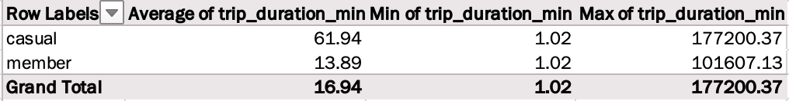
<figcaption aria-hidden="true">Trip duration data</figcaption>
</figure>

This quick glance at average trip duration by membership type shows a
stark difference in casual riders and members. Casual members go on
rides that last over 4 times as long as members’ rides.

<figure>
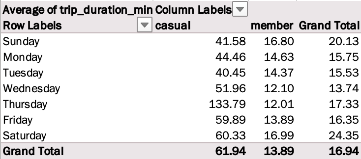
<figcaption aria-hidden="true">Average trip duration by day of the
week</figcaption>
</figure>

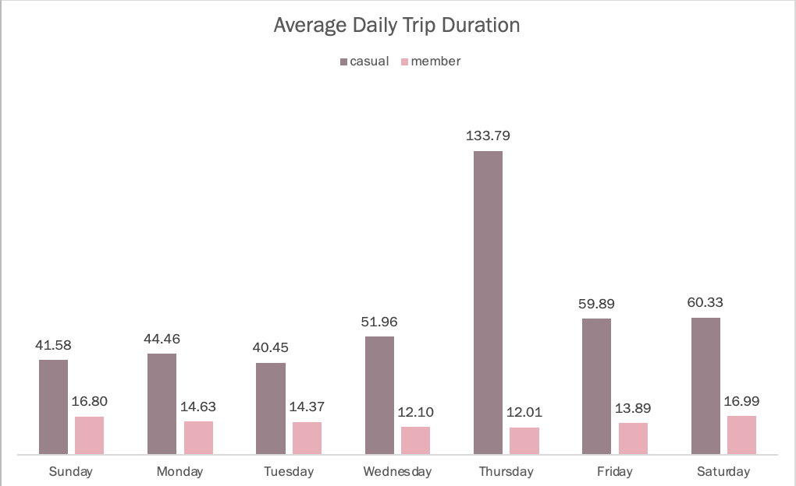

Here we can see a steady usage across the week for members, which likely
correlates to their daily commutes, and only a small increase in time on
the weekends.  
Casual riders are going on longer rides on average, but Thursdays are
when they spend over 2 hours riding on average.

<figure>
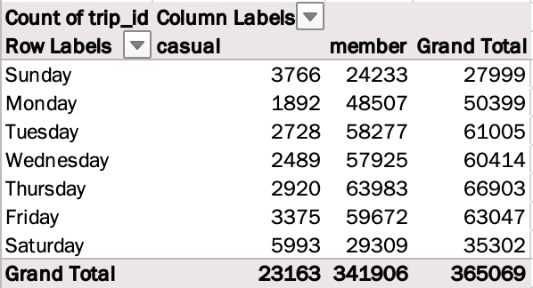
<figcaption aria-hidden="true">Rides per day of the week</figcaption>
</figure>

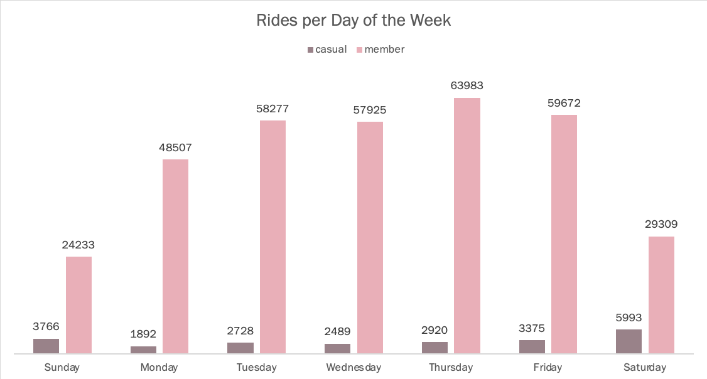

When comparing how many rides are taken per day of the week we can see
that members ride more during weekdays and casual riders prefer to ride
on the weekend.  
Members also go on significantly more rides. During Q1 shows that
members went on almost 15 times more rides than casual riders!

<figure>
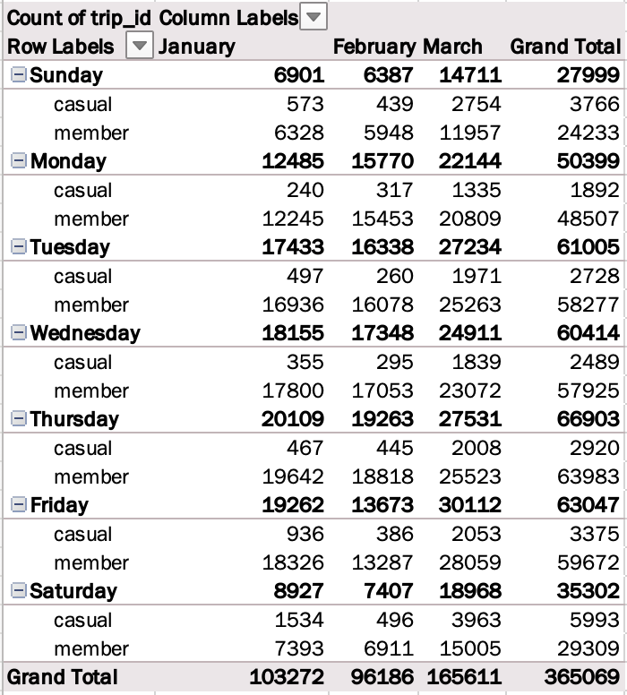
<figcaption aria-hidden="true">Monthly rides by day of the
week</figcaption>
</figure>

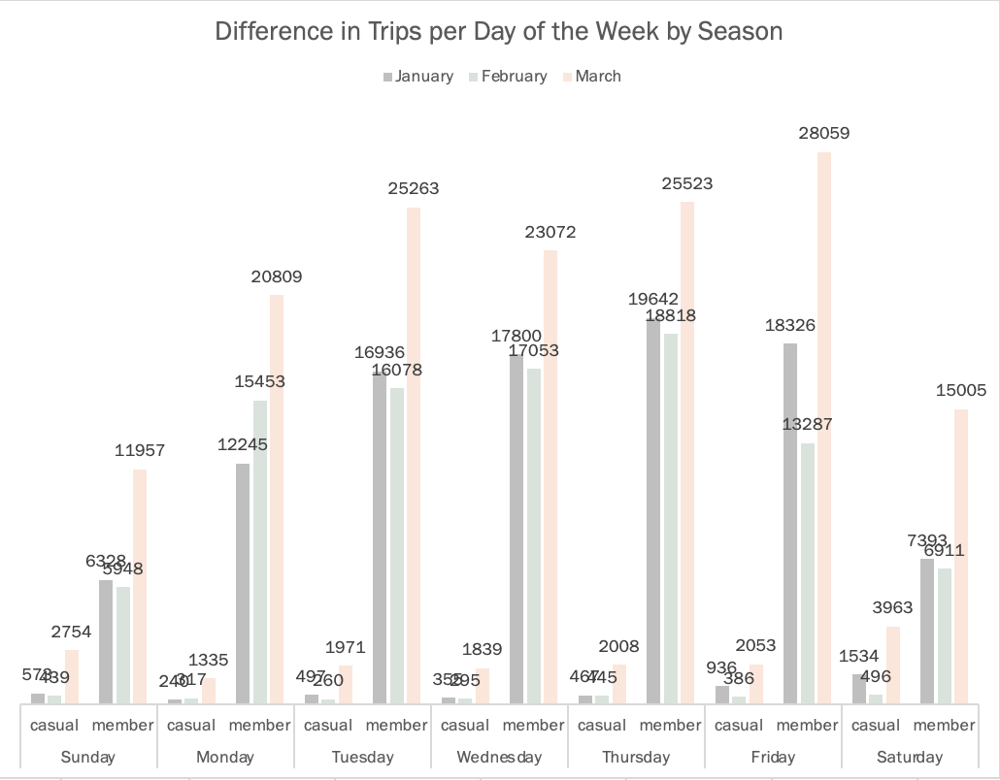

As expected, we see an increase in ridership as spring approaches and
the weather improves. There is also a small decrease in riders on every
day of the week except Monday during the month of February. Maybe this
has to do with New Year’s resolutions being broken, or perhaps the
weather was getting colder and not inviting to the average rider. That
is additional data that can be found and added to get a full picture.

### 2020

<figure>
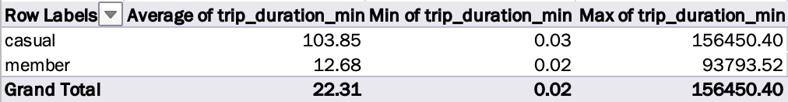
<figcaption aria-hidden="true">Trip duration data</figcaption>
</figure>

<figure>
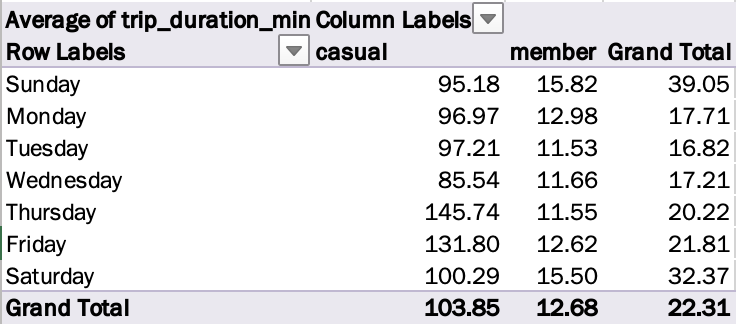
<figcaption aria-hidden="true">Average trip duration per day of the
week</figcaption>
</figure>

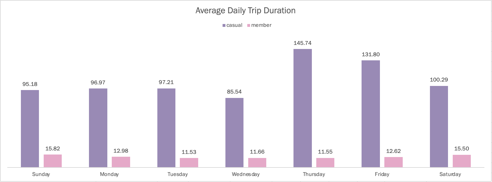

Similar to the prior year, we see longer rides by casual riders and
shorter rides for members. The members took rides that were over 2
minutes shorter than the prior year. Could they be getting faster after
all the bike exercise, or have more stations been added in more
convenient locations causing the riders to get bikes closer to their
destinations?

We can get a count of total start and end stations using R().

``` r
print("2019 - Unique Stations")
```

    ## [1] "2019 - Unique Stations"

``` r
length(unique(Trips_2019_Q1_Clean$start_station_id))
```

    ## [1] 594

``` r
length(unique(Trips_2019_Q1_Clean$end_station_id))
```

    ## [1] 600

``` r
print("2020 - Unique Stations")
```

    ## [1] "2020 - Unique Stations"

``` r
length(unique(Trips_2020_Q1_Clean$start_station_id))
```

    ## [1] 606

``` r
length(unique(Trips_2020_Q1_Clean$end_station_id))
```

    ## [1] 602

From here it appears that there hasn’t been much of a change in station
availability. We might actually be seeing our members get faster on
their commutes by constant cardio training. I would recommend digging in
with riders using a survey on health perceptions concerning cardio
fitness and maybe even looking into partnering with tech wearables to
integrate health vitals feedback to see if we are seeing our riders get
stronger or faster.

<figure>
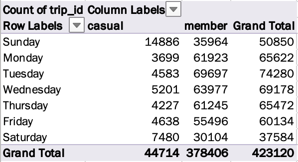
<figcaption aria-hidden="true">Rides per day of the week</figcaption>
</figure>

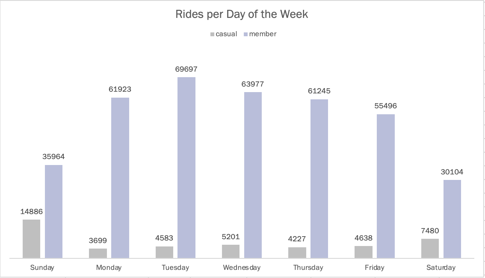

Compared to last year we are seeing that Sunday has become the favored
weekend day for a casual bike ride. Our casual riders are twice as
likely to ride on Sunday than Saturday.

<figure>

<figcaption aria-hidden="true">Monthly rides by day of the
week</figcaption>
</figure>

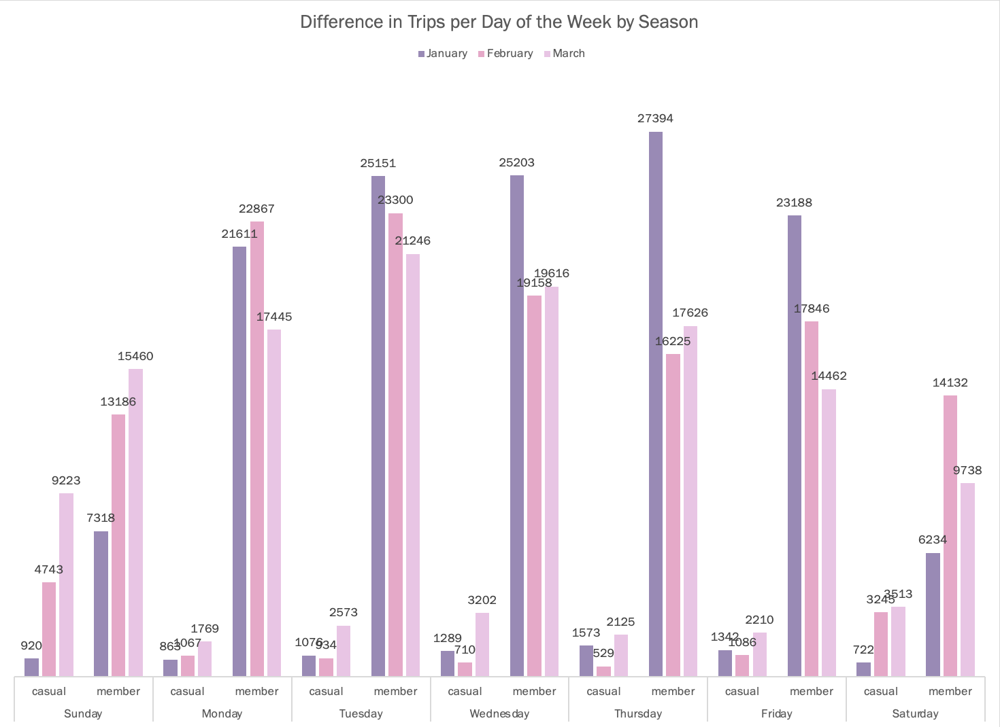

2020 shows more riders in January for members, but then dropping in
February. We could theorize about New Year’s Resolutions again, but the
rise in Coronavirus could have a major effect on data for the year.

## Plotting It Out

We’re finally ready to visualize some of this data all together.

Let’s compare the change in average rides per day between 2019 and 2020
across members and casual riders.

``` r
##First form a data frame to calculate and group average trip durations by year, day of the week, and separate into usertypes

avg_rides_per_day <- Merged_Trips_Clean %>%
  mutate(day_of_week = wday(start_time, label = TRUE, abbr = FALSE),
         fiscal_year = year(start_time)) %>%
  group_by(fiscal_year,day_of_week,usertype) %>%
  summarise(average_duration = round(mean(trip_duration_min, na.rm = TRUE))) %>%
  ungroup()

##Create a column plot comparing members and casual riders
ggplot(avg_rides_per_day, 
       aes(x=day_of_week,
           y=average_duration,
           fill = factor(fiscal_year)))+
  geom_col(position = "dodge")+
  geom_text(aes(label = average_duration), 
            position = position_dodge(width = 0.9), 
            vjust = -0.3,
            size = 8 / .pt,
            fontface = "bold")+
  facet_wrap(~usertype)+
  scale_fill_brewer(palette = "Pastel1")+
  labs(title = "Average Ride Duration by Day of the Week",
       x = "Day of the Week",
       y = "Average Ride Duration in Minutes",
       caption = "Cyclistic Q1 2019-2020",
       fill = "Year")+
  theme(axis.text.x = element_text(angle = 45))
```

<!-- -->

We can also look at the change in total number of rides.

``` r
##Determine how many rides per day of the week, separated by year
count_rides_per_day <- Merged_Trips_Clean %>%
  mutate(day_of_week = wday(start_time, label = TRUE, abbr = FALSE),
         fiscal_year = year(start_time)) %>%
  group_by(fiscal_year,day_of_week,usertype) %>%
  summarise(count_rides = n()) %>%
  ungroup()

##Create a column plot comparing members and casual riders
ggplot(count_rides_per_day, 
       aes(x=day_of_week,
           y=count_rides,
           fill = factor(fiscal_year)))+
  geom_col(position = "dodge")+
  geom_text(aes(label = count_rides), 
            position = position_dodge(width = 0.9), 
            vjust = -0.4,
            size = 7 / .pt,
            fontface = "bold")+
  facet_wrap(~usertype)+
  scale_fill_brewer(palette = "Pastel2")+
  labs(title = "Total Rides by Day of the Week",
       x = "Day of the Week",
       y = "Count of Rides",
       caption = "Cyclistic Q1 2019-2020",
       fill = "Year")+
  theme(axis.text.x = element_text(angle = 45))
```

<!-- -->

2019 data also included data about our riders like birth year and
gender.

We can use R to take a look at our customer base makeup.

``` r
##Get the current year to determine age
current_year <- as.numeric(format(Sys.Date(), "%Y"))

##Create a dataframe that calculates age based on birth year
Riders_2019 <- Trips_2019_Q1_Clean %>%
  select(usertype, gender, birthyear) %>%
  mutate(age = current_year - birthyear) %>%
  drop_na() %>%
  group_by(age, gender, usertype) %>%
  ungroup()

##Put it together to plot it out
ggplot(Riders_2019,
       aes(x=age,
           fill = gender))+
  geom_histogram(postion = "stack",
                 binwidth = 5,
                 color = "darkgray") +
  scale_fill_brewer(palette = "Pastel1") +
  scale_x_continuous(breaks = seq(from = 20, to = 130, by = 10)) +
  facet_wrap(~usertype) +
  labs(title = "Age of Riders in 2019",
       x = "Age",
       y = "Count of Riders",
       caption = "Cyclistic 2019",
       fill = "Gender")
```

<!-- -->

But due to the dramatic gap in members and casual riders the casual
graph is looking hard to read.

``` r
##Summary table of ages of riders 
Summary_Riders_2019 <- Riders_2019 %>%
  group_by(age, gender, usertype) %>%
  summarise(count_riders = n())

##Just the casuals
Summary_Riders_2019 %>%
  filter(usertype == "casual") %>%
ggplot(mapping = aes(x=age,
                     y=count_riders,
                     fill = gender))+
  geom_col(postion = "stack",
                 binwidth = 5,
                 color = "darkgray") +
  scale_fill_brewer(palette = "Pastel1") +
  scale_x_continuous(breaks = seq(from = 20, to = 130, by = 10)) + 
  labs(title = "Age of Casual Riders in 2019",
       x = "Age",
       y = "Count of Riders",
       caption = "Cyclistic 2019",
       fill = "Gender")
```

<!-- -->

``` r
##Just the members
Summary_Riders_2019 %>%
  filter(usertype == "member") %>%
  ggplot(mapping = aes(x=age,
                       y=count_riders,
                       fill = gender))+
  geom_col(postion = "stack",
           binwidth = 5,
           color = "darkgray") +
  scale_fill_brewer(palette = "Pastel1") +
  scale_x_continuous(breaks = seq(from = 20, to = 130, by = 10)) + 
  labs(title = "Age of Members in 2019",
       x = "Age",
       y = "Count of Riders",
       caption = "Cyclistic 2019",
       fill = "Gender")
```

<!-- -->

From this data we can see that our casual riders trend around 25-40
years old, while the members are older on average, typically 30-45.

``` r
##First get the amount of rides per year
total_riders_per_year <- Merged_Trips_Clean %>%
  group_by(year) %>%
  summarise(total_rides = n()) %>%
  ungroup ()

##Then figure out what percentage of riders have memberships
total_riders<- Merged_Trips_Clean %>%
  group_by(year,
           usertype) %>%
  summarise(count_of_riders = n()) %>%
  left_join(total_riders_per_year, by = "year") %>%
  mutate(percentage = ((count_of_riders / total_rides) *100)) %>%
  ungroup ()

##Map it out
ggplot(total_riders,
       aes(x=year,
           y=percentage,
           fill=usertype)) +
  geom_col() + 
  geom_text(aes(label = paste(sprintf("%.1f",percentage), count_of_riders, sep = "% = ")), 
            vjust = -0.8,
            size = 10 / .pt,
            color = "white",
            fontface = "bold") +
  labs(title = "Percentage of Rider Membership",
       x = "Year",
       y = "",
       fill = "Membership Status") +
  scale_fill_brewer(palette = "Accent") +
  scale_x_continuous(breaks = seq(from = 2019, to = 2020, by = 1))
```

<!-- -->

This data shows us that while ridership on a whole is increasing, we are
seeing fewer riders opt in for a membership. We can start to make some
recommendations about strategies to encourage increased ridership and
transition to membership from these findings.

## Who is Going Where?

``` r
##Top 6 stations to start your ride at:
start_station_maxxing <- Merged_Trips_Clean %>%
  select(start_station_id,
         start_station_name,
         end_station_id,
         end_station_name,
         usertype,
         trip_duration_min,
         start_day,
         month) %>%
  group_by(start_station_name) %>%
  summarise(count_rides_at_station = n()) %>%
  arrange(desc(count_rides_at_station))
head(start_station_maxxing)
```

    ## # A tibble: 6 × 2
    ##   start_station_name           count_rides_at_station
    ##   <chr>                                         <int>
    ## 1 Canal St & Adams St                           14155
    ## 2 Clinton St & Washington Blvd                  13640
    ## 3 Clinton St & Madison St                       13362
    ## 4 Columbus Dr & Randolph St                      9080
    ## 5 Kingsbury St & Kinzie St                       9021
    ## 6 Canal St & Madison St                          8208

``` r
##Top 6 stations to end your ride at:
end_station_maxxing <- Merged_Trips_Clean %>%
  select(start_station_id,
         start_station_name,
         end_station_id,
         end_station_name,
         usertype,
         trip_duration_min,
         start_day,
         month) %>%
  group_by(end_station_name) %>%
  summarise(count_rides_at_station = n()) %>%
  arrange(desc(count_rides_at_station))
head(end_station_maxxing)
```

    ## # A tibble: 6 × 2
    ##   end_station_name             count_rides_at_station
    ##   <chr>                                         <int>
    ## 1 Canal St & Adams St                           15067
    ## 2 Clinton St & Washington Blvd                  14865
    ## 3 Clinton St & Madison St                       13713
    ## 4 Kingsbury St & Kinzie St                       8991
    ## 5 Michigan Ave & Washington St                   8639
    ## 6 Canal St & Madison St                          8581

The top stations are all within a 1.5 mile radius of one another.

They are also all in significant locations:

- \#1 start and end station is Canal St & Adams St

  - This is the only station directly outside of Chicago Union station

- \#2, \#3, and \#6 are all located around Ogilvie Transit Center

- Columbus Dr & Randolph St and Michigan Ave & Washington St have
  variations in rides started and ended at their locations

  - These locations are located nearest to the downtown entrance of
    multiple parks

    - Millennium Park

    - Maggie Daley Park

    - Grant Park

    - Hutchinson Fields

    - The Art Institute of Chicago

  - \#4 start station (Columbus Dr & Randolph St) is \#18 for ending a
    ride. This implies that people are starting rides here and ending in
    different locations, likely made possible by all of the open bike
    lanes and parks to traverse.

- The \#4 end station, Kingsbury St & Kinzie St, is the \#8 for start
  stations and does not seem to be near any large transit centers,
  parks, or cultural tourist hubs. However, it is near a Salesforce
  tower and what appear to be corporate offices. We could assume that
  the main traffic here is from our members that are using the bikes as
  a commute option on their way into the office.

We can learn more about these stations by seeing what the top stations
are for members vs users and whether they’ve seen changes in ridership
over the year.

``` r
## separate start stations by year
start_station_year <- Merged_Trips_Clean %>%
  select(start_station_id,
         start_station_name,
         end_station_id,
         end_station_name,
         usertype,
         trip_duration_min,
         start_day,
         month,
         year) %>%
  group_by(start_station_name, year, usertype) %>%
  summarise(count_rides_at_station = n()) %>%
  arrange(desc(count_rides_at_station))

##top 2019 start stations for all users
start_station_maxxing_2019 <- start_station_year %>%
  filter(year == "2019")
head(start_station_maxxing_2019)
```

    ## # A tibble: 6 × 4
    ## # Groups:   start_station_name, year [6]
    ##   start_station_name            year usertype count_rides_at_station
    ##   <chr>                        <dbl> <chr>                     <int>
    ## 1 Clinton St & Washington Blvd  2019 member                     7611
    ## 2 Clinton St & Madison St       2019 member                     6345
    ## 3 Canal St & Adams St           2019 member                     6213
    ## 4 Canal St & Madison St         2019 member                     4461
    ## 5 Columbus Dr & Randolph St     2019 member                     4416
    ## 6 Kingsbury St & Kinzie St      2019 member                     4229

``` r
##top 2019 start stations for all users
start_station_maxxing_2020 <- start_station_year %>%
  filter(year == "2020")
head(start_station_maxxing_2020)
```

    ## # A tibble: 6 × 4
    ## # Groups:   start_station_name, year [6]
    ##   start_station_name            year usertype count_rides_at_station
    ##   <chr>                        <dbl> <chr>                     <int>
    ## 1 Canal St & Adams St           2020 member                     7586
    ## 2 Clinton St & Madison St       2020 member                     6546
    ## 3 Clinton St & Washington Blvd  2020 member                     5823
    ## 4 Kingsbury St & Kinzie St      2020 member                     4491
    ## 5 Columbus Dr & Randolph St     2020 member                     4099
    ## 6 Franklin St & Monroe St       2020 member                     3580

``` r
## separate end stations by year
end_station_year <- Merged_Trips_Clean %>%
  select(start_station_id,
         start_station_name,
         end_station_id,
         end_station_name,
         usertype,
         trip_duration_min,
         start_day,
         month,
         year) %>%
  group_by(end_station_name, year, usertype) %>%
  summarise(count_rides_at_station = n()) %>%
  arrange(desc(count_rides_at_station))

##top 2019 end stations for all users
end_station_maxxing_2019 <- end_station_year %>%
  filter(year == "2019")
head(end_station_maxxing_2019)
```

    ## # A tibble: 6 × 4
    ## # Groups:   end_station_name, year [6]
    ##   end_station_name              year usertype count_rides_at_station
    ##   <chr>                        <dbl> <chr>                     <int>
    ## 1 Clinton St & Washington Blvd  2019 member                     7570
    ## 2 Clinton St & Madison St       2019 member                     6666
    ## 3 Canal St & Adams St           2019 member                     6649
    ## 4 Canal St & Madison St         2019 member                     4748
    ## 5 Kingsbury St & Kinzie St      2019 member                     4303
    ## 6 Michigan Ave & Washington St  2019 member                     4002

``` r
##top 2020 end stations for all users
end_station_maxxing_2020 <- end_station_year %>%
  filter(year == "2020")
head(end_station_maxxing_2020)
```

    ## # A tibble: 6 × 4
    ## # Groups:   end_station_name, year [6]
    ##   end_station_name              year usertype count_rides_at_station
    ##   <chr>                        <dbl> <chr>                     <int>
    ## 1 Canal St & Adams St           2020 member                     8158
    ## 2 Clinton St & Washington Blvd  2020 member                     7010
    ## 3 Clinton St & Madison St       2020 member                     6644
    ## 4 Kingsbury St & Kinzie St      2020 member                     4495
    ## 5 Michigan Ave & Washington St  2020 member                     3672
    ## 6 Franklin St & Monroe St       2020 member                     3613

``` r
##members are topping the charts, so where are the casual riders going?

start_station_maxxing_2019_casual <- start_station_year %>%
  filter(year == "2019",
         usertype == "casual")
head(start_station_maxxing_2019_casual)
```

    ## # A tibble: 6 × 4
    ## # Groups:   start_station_name, year [6]
    ##   start_station_name         year usertype count_rides_at_station
    ##   <chr>                     <dbl> <chr>                     <int>
    ## 1 Streeter Dr & Grand Ave    2019 casual                     1219
    ## 2 Lake Shore Dr & Monroe St  2019 casual                     1142
    ## 3 Shedd Aquarium             2019 casual                      834
    ## 4 Millennium Park            2019 casual                      627
    ## 5 Michigan Ave & Oak St      2019 casual                      386
    ## 6 Adler Planetarium          2019 casual                      362

``` r
start_station_maxxing_2020_casual <- start_station_year %>%
  filter(year == "2020",
         usertype == "casual")
head(start_station_maxxing_2020_casual)
```

    ## # A tibble: 6 × 4
    ## # Groups:   start_station_name, year [6]
    ##   start_station_name         year usertype count_rides_at_station
    ##   <chr>                     <dbl> <chr>                     <int>
    ## 1 Lake Shore Dr & Monroe St  2020 casual                     1590
    ## 2 Streeter Dr & Grand Ave    2020 casual                     1530
    ## 3 Shedd Aquarium             2020 casual                      998
    ## 4 Millennium Park            2020 casual                      779
    ## 5 Michigan Ave & Oak St      2020 casual                      631
    ## 6 Theater on the Lake        2020 casual                      567

``` r
end_station_maxxing_2019_casual <- end_station_year %>%
  filter(year == "2019",
         usertype == "casual")
head(end_station_maxxing_2019_casual)
```

    ## # A tibble: 6 × 4
    ## # Groups:   end_station_name, year [6]
    ##   end_station_name              year usertype count_rides_at_station
    ##   <chr>                        <dbl> <chr>                     <int>
    ## 1 Streeter Dr & Grand Ave       2019 casual                     1934
    ## 2 Lake Shore Dr & Monroe St     2019 casual                      891
    ## 3 Millennium Park               2019 casual                      820
    ## 4 Shedd Aquarium                2019 casual                      640
    ## 5 Michigan Ave & Oak St         2019 casual                      447
    ## 6 Michigan Ave & Washington St  2019 casual                      410

``` r
end_station_maxxing_2020_casual <- end_station_year %>%
  filter(year == "2020",
         usertype == "casual")
head(end_station_maxxing_2020_casual)
```

    ## # A tibble: 6 × 4
    ## # Groups:   end_station_name, year [6]
    ##   end_station_name           year usertype count_rides_at_station
    ##   <chr>                     <dbl> <chr>                     <int>
    ## 1 Streeter Dr & Grand Ave    2020 casual                     1856
    ## 2 Lake Shore Dr & Monroe St  2020 casual                     1269
    ## 3 Millennium Park            2020 casual                     1114
    ## 4 Shedd Aquarium             2020 casual                      821
    ## 5 Michigan Ave & Oak St      2020 casual                      738
    ## 6 Theater on the Lake        2020 casual                      729

From this data we can see that our top stations for casual riders all
seem to be near recreational, leisure, and cultural areas:

- Shedd Aquarium

- Millennium Park

- Adler Planetarium

- Theater on the Lake

- Dusable Harbor

- Field Museum

- Buckingham Fountain

This would track with visitors to the city looking for a way to get
around and see the sights while being able to enjoy the ride between
locations. Perhaps it also pertains to weekend rides being more popular
even to local Chicagoans who may not be ready to bike to work, but still
want to spend some weekend time getting out and about.

## Recomendations

With all of the data gathered we can make some recommendations to
Cyclistic.

1.  Add more stations near Chicago Union Station.
    1.  They only have one station for bikes, but it is the number one
        most used station.
    2.  I would recommend supplying a survey to riders that use that
        station asking them if they believe that the number of bikes
        present is satisfactory or if they have ever been unable to
        secure a bike and had to plan another route.
2.  Offer a weekend visitor deal for casual riders.
    1.  A smaller percentage of overall riders don’t have memberships.
        It wouldn’t detract too much from overall margins to offer a
        weekend unlimited ride pass.
    2.  Weekend riders would be able to get a small taste of the freedom
        the membership provides - hopping on and off at whatever station
        suits them on short trips, rather than trying to get the most
        out of their one ride by going on a single long ride.
3.  Advertise in transit hubs like Chicago Union Station and Ogilvie
    Transit Center.
    1.  These stations have the highest amount of riders likely
        commuting into the city - Chicago Union Station specifically
        services the Amtrak line for people who commute from a bit
        further out.
    2.  Add focus to other hubs like Millennium Station, La Salle Street
        Station, and Van Buren Station to encourage these commuters as
        well.
4.  Offer seasonal deals.
    1.  The existing members are willing to pay for a Cyclistic
        membership on top of their train tickets, so no major change to
        pricing appears necessary, but maybe offering a deal when the
        weather starts to get nicer in Q2 where they can get a
        discounted rate when they buy a yearly membership in the spring.
    2.  New Year’s is also a great time to increase advertisement as
        people are typically making and breaking New Year’s Resolutions.
        Could also focus on the data points that riders who got a
        membership were making their same commute times 2 minutes faster
        to the prior year! Get some testimonials from members with some
        before and after pics of their fitness journey and talk about
        how change is achieved by adjusting your habits - and a commute
        is a major habit that could affect overall fitness.
5.  Court the College/University crowd.
    1.  The demographic for all riders is typically around their early
        30s to mid 40s. The 18-25 year old population is almost
        nonexistent.
    2.  Stations should be placed around college and university
        campuses - maybe with school colors on the stations or bikes to
        advertise to them.
    3.  Offers can be made with the local college or university to get
        discounted membership rates for students - maybe even a cheaper
        deal during the first month of school in the fall when students
        are more likely to want to explore their new home.
    4.  Add baskets to bikes. College students often don’t have cars of
        their own and need to get around to run errands. Allowing for a
        larger storage option could help with grocery runs.
6.  Court female riders.
    1.  Stations should be well lit in the evenings and have a safety
        beacon where police can be called to assist. Women are assaulted
        on a higher basis than men and have historically been wary of
        public transit options. Advertise the safety features included
        at stations and the autonomy it provides to women.
    2.  Ensure bike seats are comfortable.
    3.  Ensure wheel spokes and chains are covered to protect garments
        like skirts or wide-legged trousers from getting caught causing
        damage or even injury.

These recommendations could be offered for collaboration with the
marketing, financial, and planning teams to ensure that the solutions
are viable.

Based on the data that we have I would feel confident presenting this to
Cyclistic.


